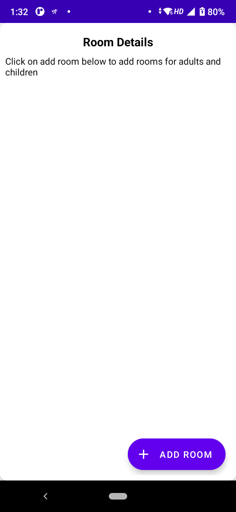
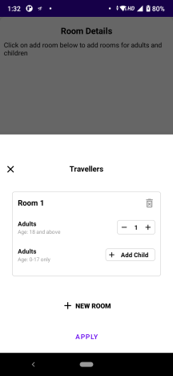
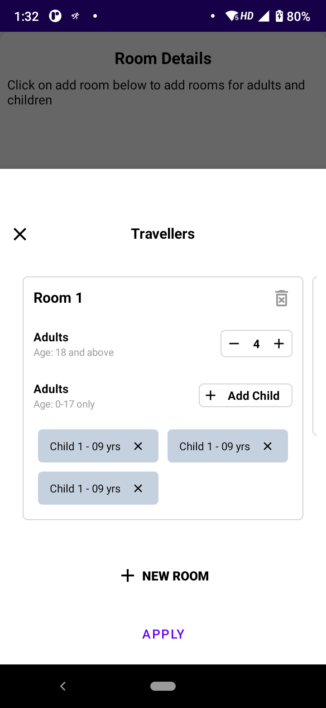
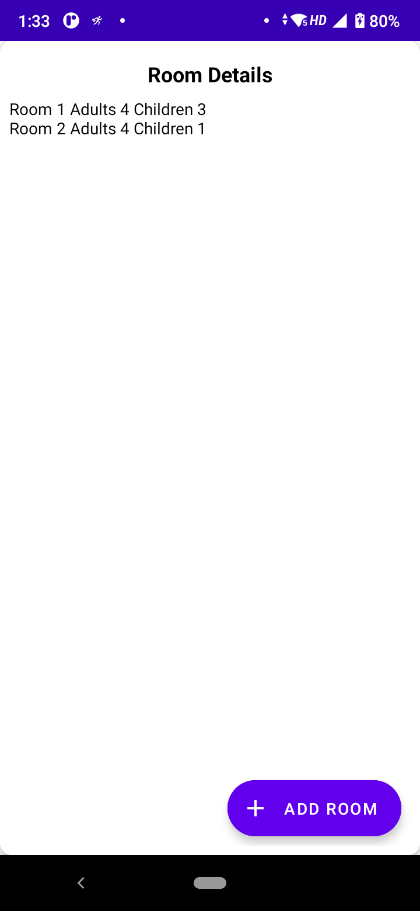

# InvisiaAssignment
To implement and design a Room of Adults and children with some given validations

 
 
 
 
 

Create the above screen in activity with button and text view, on click button open a bottom sheet with the above UI.
Validation on click of a new room.

* Max number of Room 9
* Max adult per room is 6
* Max child per room is 4
* Onclick of Apply should show the number of rooms and the number of children associated with room on Text view in Activity.
